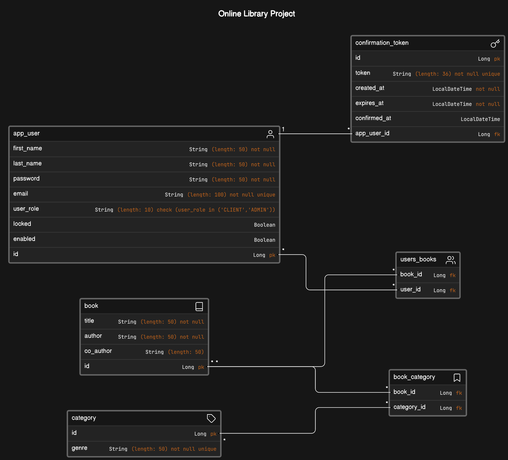

# OnlineLibrary

---

## Description
- OnlineLibrary is a web application for managing digital libraries, 
enabling users to register, authenticate, and perform book-related tasks.
It employs UUID token-based authentication for security. 

- After registration, users must confirm their email via a unique UUID 
token sent to them. Upon successful login, a JWT token is issued to encrypt 
user data in the browser, ensuring a stateless service. This token is 
validated with each user request, granting access upon verification.

- This project serves as a personal learning platform, allowing for
experimentation with new tools, architectures, and techniques while 
providing practical experience and enjoyment.

---

## Key Features

### 1. User Registration and Authentication:
- Users can register to create an account.
- A UUID token-based authentication is sent to the user's email, ensuring secure registration.

### 2. User Login and JWT:
- After successful registration and email confirmation via the UUID token, users receive a JWT upon login.
- This JWT ensures the service remains stateless while facilitating secure communication between the UI and the service.

### 3. Book Management:
- Supports CRUD operations (Create, Read, Update, Delete) for books.
- Administrators have exclusive rights to add, update, and delete books.
- All users can view the entire book collection and borrow books.
- Each user has a personal reading list visible only to them.

### 4. User-Book Relationship:
- Books and app users have a many-to-many relationship, allowing users to manage their book collections.

### 5. Category Management:
- The system features categorization for books.
- Categories and books maintain a many-to-many relationship, facilitating flexible organization.

--- 

## Technologies Used

### 1. Programming Languages and Frameworks
- **Java**: JDK 21.0.2
- **Spring Boot**: v3.1.4
- **Spring Security**: v5.5.x
- **Hibernate ORM**: Framework for database operations
- **PostgreSQL**: v15

### 2. Libraries
- **Lombok**: Simplifies Java code with annotations
- **MapStruct**: Mapping and conversion between Java beans

### 3. Development Tools and IDEs
- **IntelliJ IDEA Ultimate Edition**: IDE for Java development
- **Postman**: API testing and development tool

### 4. Testing Frameworks and Tools
- **Postman**: API testing and development
- **Spring Boot Test**: Integration testing provided by Spring Boot
- **JUnit**: Unit testing framework for Java

### 5. Documentation and API Tools
- **Swagger**: API documentation and testing
- **Springdoc OpenAPI**: OpenAPI documentation and UI for Spring Boot projects

### 6. Architecture and Security
- **Three-Tier Architecture**: Frontend, Backend, and Database layers
- **RESTful API**: Design for web services
- **JWT (JSON Web Token)**: Token-based authentication for secure communication
- **UUID Tokens**: Unique tokens for user registration and confirmation

--- 
## Project Schema Diagram

