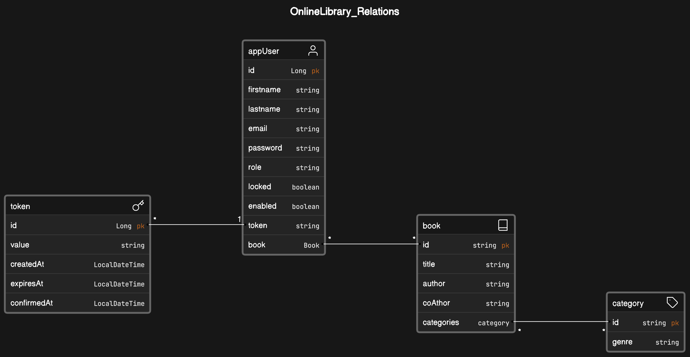

# OnlineLibrary

## Description
- OnlineLibrary is a web application designed to manage a digital library, 
allowing users to register, authenticate, and perform various operations on books. 
The project utilizes token-based authentication for user registration and login, 
providing a secure environment for managing user-specific data.

## Key Features
### 1. User Registration and Authentication:
- Users can register with the system to create an account.
Token-based authentication ensures secure user login.

### 2. Book Management:
- CRUD operations (Create, Read, Update, Delete) for books are supported.
Only administrators can add new books, update existing ones, delete unwanted entries.
All users can view the entire book collection and borrow all kinds of books to read. 
Each user, personal reading list is kept to themselves only.

### 3. User-Book Relationship:
- Books have a many-to-many relationship with app users, allowing users to own and 
manage their book collections.

### 4. Category Management:
- The system includes a category feature that allows books to be categorized.
Categories have a many-to-many relationship with books, enabling flexible organization.

## Project Structure
- User Management: Handles user registration, authentication, and user-book relationships.

- Book Management: Provides endpoints for CRUD operations on books.

- Category Management: Manages book categories and their relationships.

## Technologies Used
### 1. Development
- Spring Boot
- Spring Security
- Hibernate
- RESTful API
- Lombok
- Postgres

### 2. Testing
- Postman
- JUnit Tests

## Project Relationships Diagram

